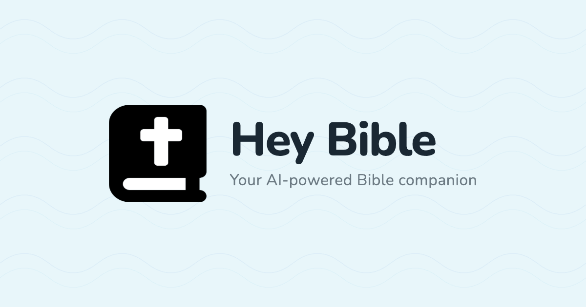

<p align="center">
  
</p>

# Hey Bible Podcast

The whole Bible read aloud, one book at a time. Audio generated with the ElevenLabs Bill voice via Venice AI TTS, published as a monthly podcast at [podcast.heybible.org](https://podcast.heybible.org) (also reachable at the brand URL [✝.fm](https://xn--pci.fm)).

- **Audio pipeline** (Python) — generates one permanent audio file per verse daily (stored in `verses/`). Chapter and book compilations are generated locally as needed for R2 releases but are not committed to this repo.
- **Web player** (Astro + Tailwind v4 in `web/`) — static site at ✝.fm with per-book pages, chapter seek, and a Podcasting 2.0 RSS feed.

## Project Structure

```
hey-bible-podcast/
├── verses/                 # Permanent library — one audio file per verse (the source of truth)
│   └── {book}/{chapter}/{book}-{chapter}-{verse}-web.mp3
├── assets/titles/          # Pre-generated "Chapter N" audio clips (for releases)
├── intermediate/           # Compiled book + chapter sidecar (generated locally for R2 releases; not committed to git)
│   ├── {book}-web.mp3
│   └── {book}-web.json
├── scripts/                # Audio pipeline
│   ├── generate-verses.py          # Daily: generate individual verses (500/day). Only verses are committed.
│   ├── compile-book.py             # Monthly: stitch from verses → full book + sidecar JSON (for R2)
│   ├── release-book.py             # Monthly 1st: upload to R2, patch books.json
│   ├── bible_data.py               # 66-book chapter/verse counts
│   ├── bible_text.py               # WEB verse text retrieval
│   ├── r2.py                       # Cloudflare R2 upload helper
│   ├── build-bible-json.py         # Build WEB bible JSON from source
│   └── run-daily.sh                # Cron wrapper
├── state/
│   └── progress.json       # Current book/chapter/verse pointer + completed chapters list
└── web/                    # Astro site — see web/README.md
```

## Stats

- **Total verses:** 31,098 (WEB)
- **Daily batch:** 500 verses
- **Voice:** ElevenLabs Bill (via Venice TTS)
- **Translation:** [World English Bible](https://worldenglish.bible) — public domain

**Note:** Only the individual verse files are committed to this repository. Chapter and full-book audio are generated on demand for releases and uploaded to R2.

## Current Progress

| Book | Status |
|------|--------|
| Genesis | ✅ Released |
| Exodus | ✅ Released |
| Leviticus | ✅ Released |
| Numbers | ✅ Released |
| Deuteronomy | ✅ Released (June 2026, first-Sunday cadence) |
| Joshua | ✅ Complete (verses + chapters ready; next first Sunday) |
| **Judges** | 🔄 **In progress** — currently at **Judges 21:14** |

See [`state/progress.json`](state/progress.json) — book, chapter, verse pointer plus the list of completed chapters.

## Cron Schedule

All jobs run on this host via the Hermes agent (Moses) and post status notifications to Discord.

### Daily — `scripts/generate-verses.py` (midnight UTC)
- Read verse texts from `scripts/data/web-bible.json` (pre-built from the WEB USFX XML in [seven1m/open-bibles](https://github.com/seven1m/open-bibles))
- Generate one MP3 per verse via Venice TTS (ElevenLabs Bill voice, `tts-elevenlabs-turbo-v2-5`)
- Write files to `verses/{book}/{chapter}/` (one permanent file per verse — this is the library)
- Update `state/progress.json`
- Commit and push the new verse files only

### First Sunday of the month — Book Publish (compile + release, ~8 AM NY / 12:00 UTC)
- The dedicated "Hey Bible First Sunday Book Publish" Hermes cron (no_agent script) runs every Sunday but only acts on the first Sunday of the month.
- Finds the earliest completed (verses + chapters) but unreleased book.
- Runs compile-book.py: stitches full book audio from permanent verses/ (backfills chapters if needed), generates spoken book title via Venice "Bill", concatenates with chapter title clips, produces intermediate/{book}-web.mp3 + sidecar JSON, uploads unlisted preview to R2.
- Immediately runs release-book.py (review step skipped per 2026-06 policy): re-uploads with streaming headers, patches web/src/data/books.json to status=available + releaseTag + size, git commits/pushes **master**, then syncs the lightweight **`cf-deploy-web`** branch so Cloudflare can build (see Web deploy below).
- Accelerated cadence: Sunday Hermes job runs `RELEASE_COUNT=2 bash scripts/run-next-book-release.sh` (up to two books per Sunday) + Automate It social announces in review.

## Audio hosting (Cloudflare R2)

The `<audio>` URL is built from a single constant, `R2_PUBLIC_BASE` in `web/src/lib/books.ts`. Set it to the bucket's custom domain (e.g. `https://audio.heybible.org`) once the bucket is live.

One-time setup:

1. Create an R2 bucket (e.g. `hey-bible-audio`) and attach a custom domain in the Cloudflare dashboard.
2. Create an R2 API token (Object Read & Write, scoped to the bucket); save the Account ID, Access Key ID, and Secret Access Key.
3. Both `compile-book.py` and `release-book.py` upload to R2, so both crons need these env vars set:
   - `R2_ACCOUNT_ID`
   - `R2_ACCESS_KEY_ID`
   - `R2_SECRET_ACCESS_KEY`
   - `R2_BUCKET_NAME`

`release-book.py` sets `Content-Type: audio/mpeg` and `Content-Disposition: inline` per upload — both are required for in-browser playback on mobile, since GitHub Releases serves `application/octet-stream` + `attachment` and iOS Safari refuses to stream that.

## Chapter sidecar JSON

`{book}-web.json` is uploaded to R2 alongside `{book}-web.mp3` and is used both by the web chapter player and by the `<podcast:chapters>` link in the RSS feed (Apple Podcasts / Overcast / Pocket Casts render it as the chapter list).

```json
{
  "book": "genesis",
  "title": "Genesis",
  "duration": 12345.67,
  "chapters": [
    { "number": 1, "title": "Chapter 1", "start": 0,     "end": 240.5,  "duration": 240.5 },
    { "number": 2, "title": "Chapter 2", "start": 240.5, "end": 495.1,  "duration": 254.6 }
  ]
}
```

One entry per chapter — `start` is the offset of the spoken "Chapter N" intro, `end` is where the chapter content finishes.

## Manual Commands

```bash
python3 scripts/generate-verses.py    # daily
python3 scripts/compile-book.py       # (called by first-Sunday cron)
python3 scripts/release-book.py       # (called by first-Sunday cron; direct publish, no review pause)
```

## File naming convention

| Kind             | Pattern                              | Example                  |
|------------------|--------------------------------------|--------------------------|
| Verse            | `{book}-{chapter}-{verse}-web.mp3`   | `genesis-1-1-web.mp3`    |
| Chapter          | `{book}-{N}-web.mp3`                 | `genesis-1-web.mp3`      |
| Book release     | `{book}-web.mp3`                     | `genesis-web.mp3`        |
| Chapter sidecar  | `{book}-web.json`                    | `genesis-web.json`       |

## Requirements

- Python 3.8+
- ffmpeg (for the concat demuxer)
- Venice API key (env `VENICE_API_KEY` or `~/.openclaw/openclaw.json` for legacy fallback)
- `boto3` and Cloudflare R2 credentials (used by `compile-book.py` and `release-book.py`)

## ffmpeg concatenation

Lossless stitching via the concat demuxer:

```bash
# Verses → chapter
ffmpeg -f concat -safe 0 -i concat.txt -acodec copy chapter-N.mp3

# Chapters → book
ffmpeg -f concat -safe 0 -i concat.txt -acodec copy book-web.mp3
```

## Web player

The Astro static site lives in `web/` and deploys via Cloudflare Workers at [podcast.heybible.org](https://podcast.heybible.org) (also reachable at the brand URL [✝.fm](https://xn--pci.fm)). It reads `web/src/data/books.json` for the index, fetches the chapter sidecar at build time for each released book, and exposes the podcast RSS at `/feed.xml`. See [`web/README.md`](web/README.md) for local dev, deploy, and the data contract.

### Web deploy (Cloudflare) — important

The monorepo git pack is multi‑GB (verse/chapter MP3s tracked on `master`). Cloudflare **times out cloning `master`**, so production builds from a **tiny branch that contains only the Astro site**:

| | |
|--|--|
| **Branch** | `cf-deploy-web` |
| **Root directory in CF** | *(empty)* — site is at branch root, **not** `web/` |
| **Build** | `npm run build` → output `dist` |

**After every book release** (when `books.json` changes), the lightweight branch must be updated:

```bash
# Prefer the automatic path — release-book.py already runs this after push:
bash scripts/sync-cf-deploy-web.sh

# Or with a custom commit message:
bash scripts/sync-cf-deploy-web.sh "deploy: after releasing Ruth"
```

Manual / recovery checklist:

1. `python3 scripts/release-book.py` (or `RELEASE_COUNT=2 bash scripts/run-next-book-release.sh`)
2. Confirm `scripts/sync-cf-deploy-web.sh` ran (or run it yourself)
3. Cloudflare builds `cf-deploy-web` → verify https://podcast.heybible.org/feed.xml lists the new book(s)
4. Spotify may lag; refresh the feed in Spotify for Podcasters if needed

Do **not** point Cloudflare production at `master` with root `web/` unless the monorepo is slimmed down first.
